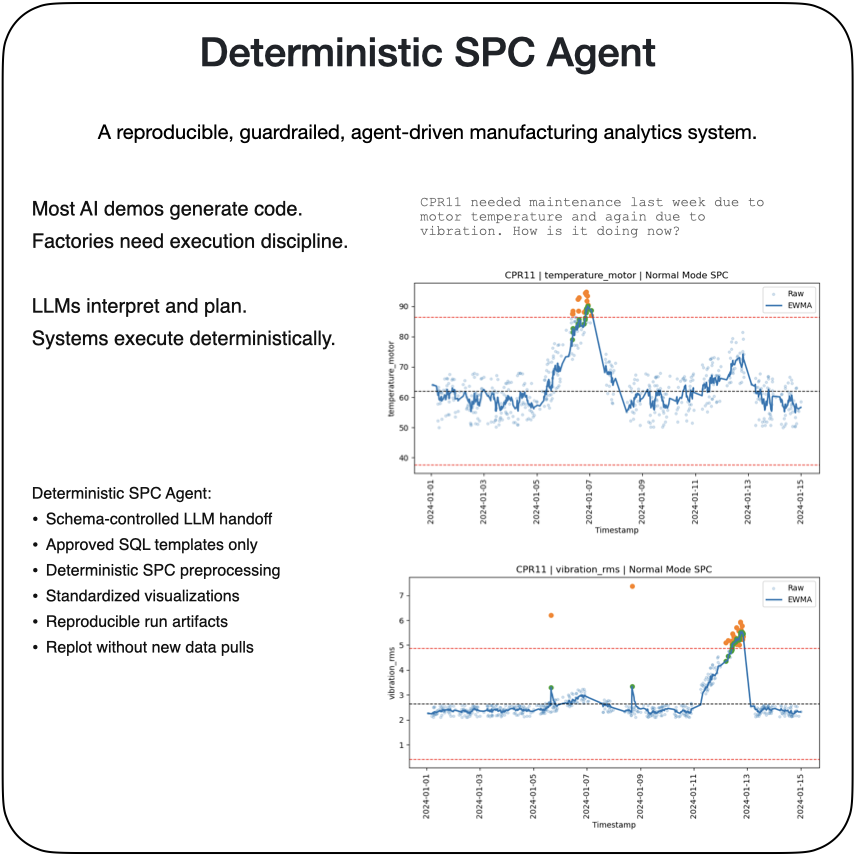
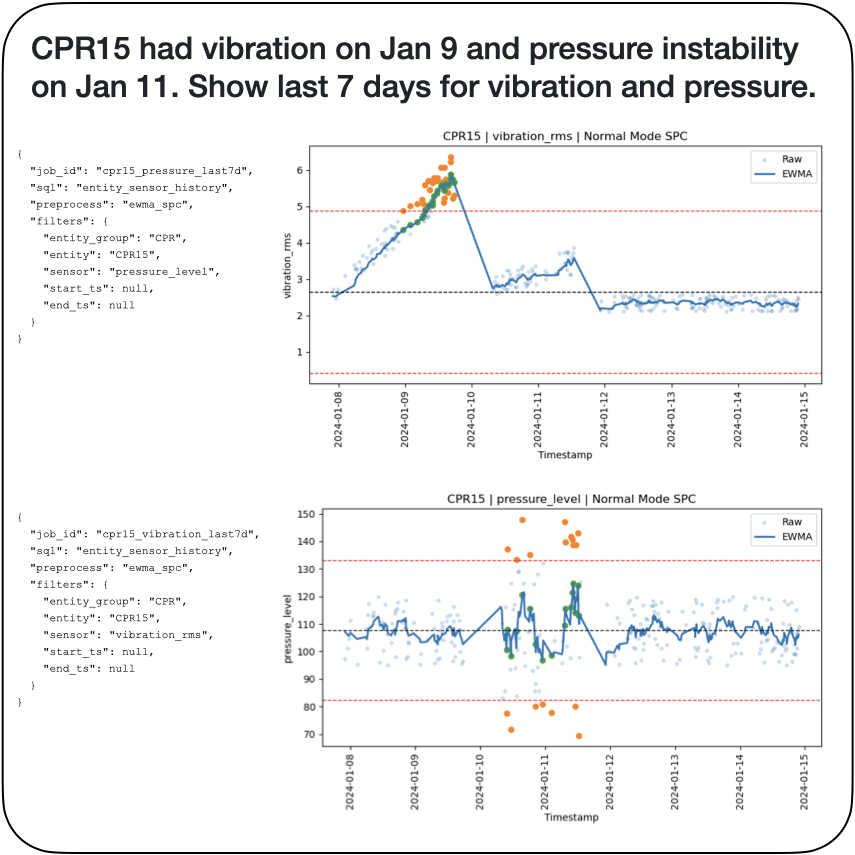
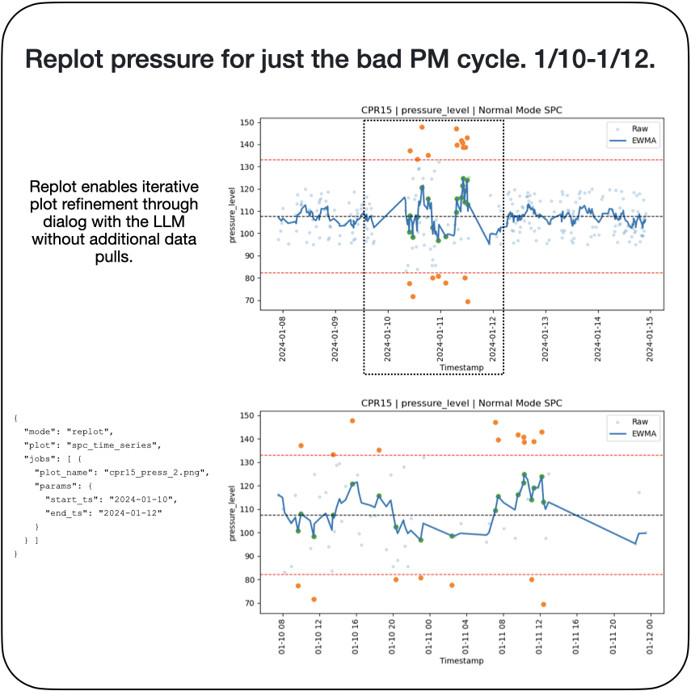
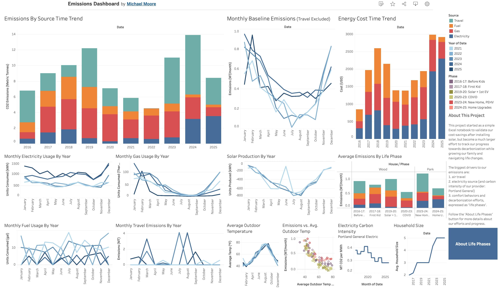
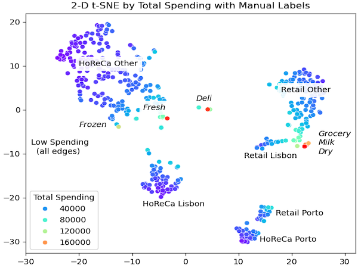
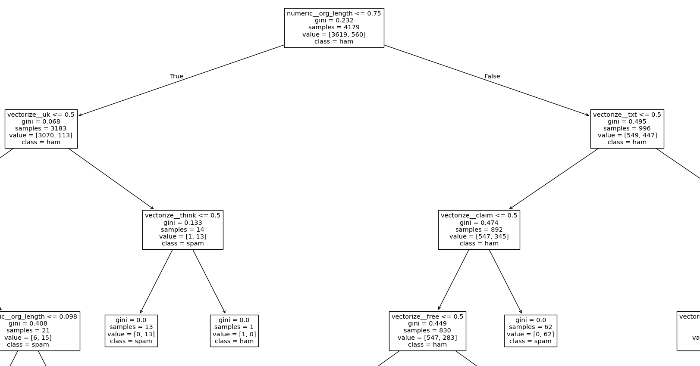
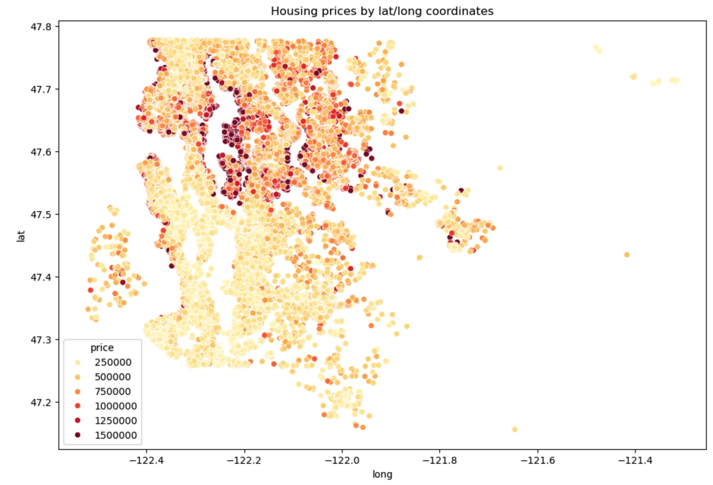

## Process Engineer | Data Scientist | Chemist

I turn messy manufacturing and business data into solutions leaders can act on.

I’m a data analytics and process engineering professional with 12+ years in high-volume manufacturing at Intel, including 6+ years in management roles. My work sits at the intersection of data analytics, data science, process engineering, and manufacturing operations, where I use data to improve throughput, yield, cost, and create business impact.

I specialize in data analytics, data visualization, and applied data science—translating complex datasets into clear insights, predictive models, and scalable tools. I’ve led cross-functional initiatives, built analytical frameworks from scratch, and partnered with engineering, operations, and leadership teams to drive measurable business outcomes. My strength is not just analysis, but connecting data to execution through people leadership and technical program management.

Today, I’m focused on roles where analytics directly informs strategy and operations, including Data Analyst, Senior Data Analyst, Business Analyst, Data Scientist, Process Engineer, Engineering Manager, Manufacturing Operations Manager, and Technical Program Manager roles. I bring a rigorous engineering mindset and a bias toward practical solutions that work at scale.

What I do best:
- Turning ambiguous problems into structured, data-driven decisions
- Building and delivering KPIs, dashboards, and operational metrics – data storytelling
- Applying statistical analysis, machine learning, and visualization to real-world problems
- Partnering with stakeholders to design sustainable, scalable solutions
- Driving projects to completion using lean principles and DMAIC

## Projects

#### Deterministic SPC Agent

[GitHub](https://github.com/michaelm-503/deterministic-spc-agent)

Deterministic SPC Agent is a guardrailed, reproducible manufacturing analytics framework that applies LLM-driven planning without allowing AI to generate SQL or analysis code. The LLM produces a structured JSON plan, which is validated and executed through approved SQL templates, deterministic SPC preprocessing, and standardized visualization modules.

The system supports fleet analytics, EWMA-based control logic, reproducible run artifacts, and a replot mode that enables visualization refinement without re-running SQL. The goal is to explore how agentic AI can operate safely inside a 24/7 factory environment where auditability and execution discipline matter.

<table>
<tr>
<td></td>
<td></td>
<td></td>
</tr>
</table>

#### Home Emissions Data Viz

[Tableau](https://public.tableau.com/app/profile/michael.moore1034/viz/EmissionsDashboard_17674163473330/Dashboard1)

This data viz tracks 9 years of trends and correlations in my energy usage and emissions at home. Click through the story mode to see my insights on how various life changes and home upgrades have shifted my emissions.

#### Customer Segmentation and Business Insights

[GitHub](https://github.com/michaelm-503/customer-segmentation)

This project applies unsupervised learning and exploratory analysis to segment customers for a wholesale food and supply distributor operating in Portugal. Using annual spending data across product categories, along with channel (HoReCa vs. Retail) and regional indicators, the goal is to uncover meaningful customer segments and translate those patterns into actionable business insights.

Rather than treating clustering as a purely technical exercise, this analysis emphasizes:
- Understanding the business context behind the data
- Evaluating multiple clustering approaches and their limitations
- Iteratively refining features to balance model stability, interpretability, and usefulness
- Connecting data-driven segments to practical strategies for growth, retention, and operations

#### Ham vs. Spam: SMS Text Classification 

[GitHub](https://github.com/michaelm-503/spam_classification)

This project explores a classic machine learning problem: classifying SMS messages as ham or spam, using a dataset full of noisy, shorthand-heavy language from early-2000s mobile texting.

Rather than treating this as a simple modeling exercise, I approached it as a full data science workflow, emphasizing interpretability and robustness under changing assumptions. The project combines exploratory analysis, iterative feature engineering, and systematic model evaluation to understand why certain approaches work—and where they fail.

#### Housing Prices in King County, Washington

[GitHub](https://github.com/michaelm-503/housing-prices-king-county)

This project explores housing price prediction in King County, Washington using linear regression–based models. Starting from a broad set of structural and geographic features, the goal was to understand how much of housing price variation can be explained by linear relationships, and where those models begin to break down.

Rather than focusing solely on maximizing performance, the emphasis was on:
- Careful data cleaning and feature treatment, especially for ordinal and hybrid variables
- Understanding the limitations of linear models in a spatial, economically complex problem
- Interpreting model coefficients and residual behavior
- Evaluating the impact of regularization, outlier handling, and feature selection

## Work Experience

#### Engineering Manager, Intel Corporation (3/2022-7/2025)

- Automated ingestion and visualization of maintenance data (SQL, Python, JMP) to enable engineers, technicians, and people managers to measure performance and identify problems in real-time, **reducing maintenance rework events by 50% and eliminating $8M+ annually in waste**.
- Developed a new model for manufacturing output and capacity to improve forecasting of equipment purchases, **avoiding $42M in unnecessary tool purchases without impacting factory output**.
- Led a factory-wide effort that achieved a two-quarter acceleration of factory retooling. Coordinated roadmaps and held teams accountable to meeting planned metrics. **Saved $8.5M without impact to output, operations, or customers**.
- Established quality-focused engineering culture and effective systems. Best-in-class among peer teams for human-error rates.
- Led weekly reviews to track org-level quality metrics, including SPC and fault detection. **Drove org-wide quality performance from 75% to 95%+ against defined KPIs within one quarter**. 

#### TD Module Group Leader, Intel Corporation (3/2019-3/2022)

- Developed regression-based automated process control to decrease product variability and eliminate a device reliability flaw. **Increased total product yield by 2%, resulting in $50M+ in annual savings**.
- Built a KPI dashboard to enable daily tracking of metrics and Pareto-driven process improvement, **leading to a 14% increase in equipment productivity and avoiding $12M in equipment purchases**.
- Applied lean strategies to reduce maintenance duration times by 33%, **leading to $2M annual labor savings**.
- Developed an onboarding course utilizing a “lab” format to guide new engineers through creating their first automated report using internal scripting tools.

#### Process Engineer, Intel Corporation (2/2013-3/2019)

- Automated real-time statistics across 150+ process sensors to detect drift and halt processing at the first signs of failure. Utilized anomaly detection and regression to determine yield and quality correlations. Implemented process changes and equipment upgrades that **reduced scraps from 5% to 1% and saved $10M+ annually**.
- Implemented equipment automation strategies to increase technician bandwidth by 10x, enabling a 7x growth in factory capacity while only increasing technician headcount by 3x. 
- Utilized tool automation to simplify process control systems, reducing process complexity by 75%. Developed scripts for computer-assisted quality checks, increasing both engineer productivity and quality.
- Developed a unified factory operations dashboard integrating multiple data sources (SPC, MES, FDC), **reducing manual data handling by 125+ engineer-hours weekly**.

## Education

- Doctorate (Ph.D.), Chemistry, University of California, Berkeley
- Bachelor of Arts (B.A.), Chemistry, with High Honors, Oberlin College

## Certifications

- Data Science with AI Boot Camp (in progress, expected 2/2026), Codecademy.com	
- Analyze Data with SQL Skill Path, Codecademy.com

## Skills
- **Data & Tools**: SQL, JMP (advanced, JSL), Python (pandas, matplotlib, scikit-learn), Excel (advanced, macros), Power BI, Tableau, Jupyter Notebooks, data storytelling
- **Statistical Methods**: Statistical process control (SPC), Design of experiments (DOE), ANOVA, linear regression, classification, anomaly detection, time series analysis, predictive modeling
- **Program & Project Management**: KPI development, project scheduling, milestone tracking, risk management, stakeholder communication, cross-functional leadership, change control, vendor management
- **Process Improvement**: Pareto analysis, DMAIC, lean manufacturing, continuous improvement, Kaizen
- **Quality & Reliability**: Failure mode and effects analysis (FMEA), 8D, root cause analysis (RCA), model-based problem solving, CAPA, defect reduction, fault detection and classification (FDC)
- **Equipment**: Plasma etch (RIE), Thin-film Deposition (metals sputtering, physical vapor deposition, ALD, CVD)

